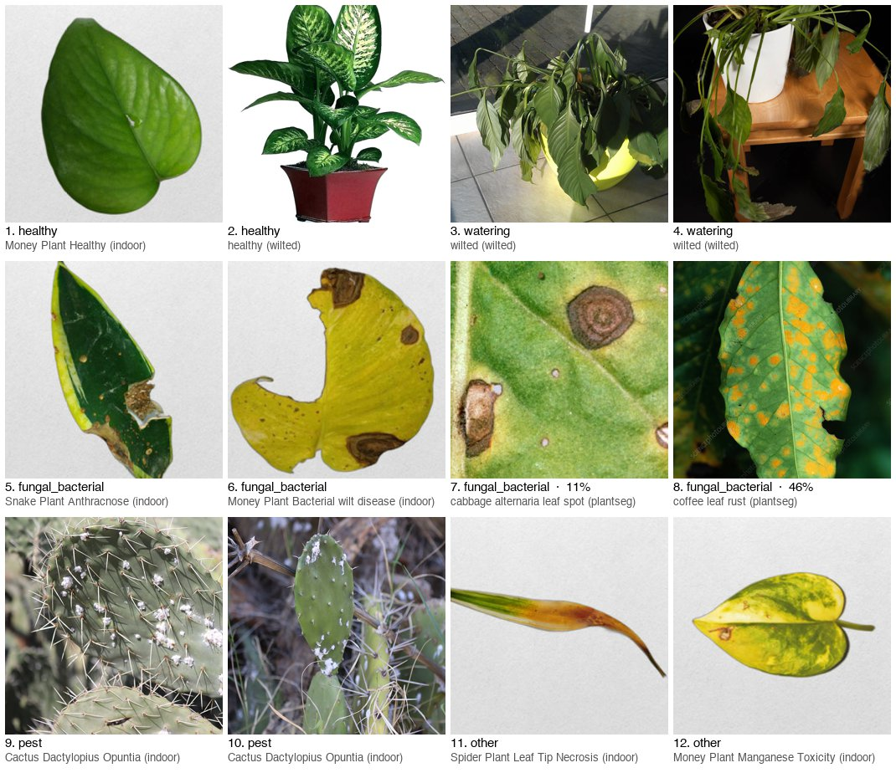

# 10-718: Machine Learning in Practice

## Data

```bash
mkdir -p data/raw && cd data/raw
curl -L -o indoor.zip   https://www.kaggle.com/api/v1/datasets/download/abdulahad0296/indoor-plant-disease-detection-dataset
curl -L -o wilted.zip   https://www.kaggle.com/api/v1/datasets/download/russellchan/healthy-and-wilted-houseplant-images
curl -L -o plantseg.zip https://zenodo.org/api/records/17719108/files/plantseg.zip/content
for z in indoor wilted plantseg; do unzip -q $z.zip -d $z && rm $z.zip; done
```

| Dataset | Images | Train / Valid / Test | Classes | In test set |
|---|---|---|---|---|
| [Indoor Plant Disease Detection](https://www.kaggle.com/datasets/abdulahad0296/indoor-plant-disease-detection-dataset) | 4,865 real (21,097 incl. `Augmented_*` copies) | 4,015 / 455 / 395 real | 16 (5 plants × condition) | 100 |
| [Healthy and Wilted Houseplants](https://www.kaggle.com/datasets/russellchan/healthy-and-wilted-houseplant-images) | 854 unique (904 files) | no splits | 2 (452 healthy / 452 wilted) | 50 |
| [PlantSeg](https://zenodo.org/records/17719108) | 7,774, each with a lesion mask | 5,367 / 846 / 1,561 | 115 diseases, 34 crops | 50 |

## Test set

`python build_testset.py` writes `data/testset.csv` (200 images, labels `healthy / watering / fungal_bacterial / pest / other`).
`data/gold_advice.json` is the advice answer key, from UMD and Clemson extension pages.
`data/curated.csv` is a hand-picked 12-image subset (clear examples of all 5 labels, from all 3 datasets) for manual evaluation, shown one by one in [curated.md](curated.md):



## LLM baseline (Gemini free tier)

```bash
python -m venv .venv && source .venv/bin/activate && pip install -r requirements.txt
cp .env.example .env   # paste a free key from https://aistudio.google.com/apikey
python classify.py     # 100 Indoor test images -> data/preds/<model>.csv, prints accuracy + confusion matrix
```

`llm.py` sends each image with a fixed prompt and forces the answer to one of the 5 labels. Set `GEMINI_MODEL` in `.env` to switch model; `classify.py --source all --n 200` runs the whole test set. `python report.py` writes `reports/<model>.md`.

Results: [gemini-3.1-flash-lite](reports/gemini-3.1-flash-lite.md) (62% on the 100 Indoor images).
