# Curated examples

12 hand-picked images from `data/testset.csv` for manual evaluation (also in `data/curated.csv`).
Gold advice for each label is in `data/gold_advice.json`.

## 1. healthy

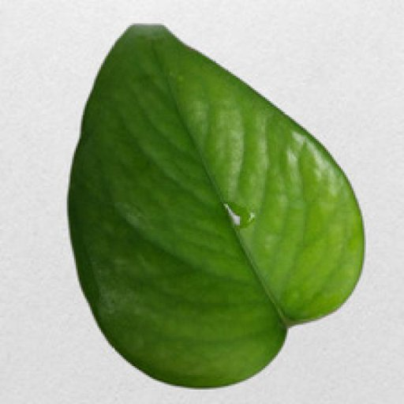

- Original label: Money Plant Healthy
- Source: indoor
- File: `data/raw/indoor/indoor/test/Money_Plant_Healthy/Money_Plant_Healthy_024_jpg.rf.018f9de0ce68414abd8656ad3ffc2ec5.jpg`

## 2. healthy

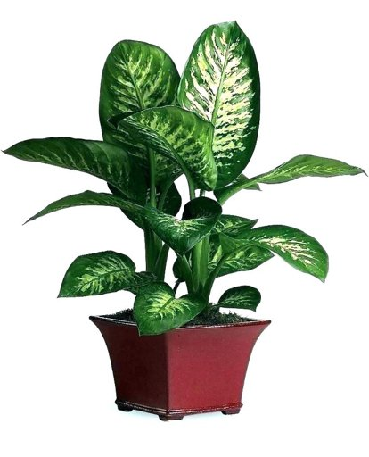

- Original label: healthy
- Source: wilted
- File: `data/raw/wilted/houseplant_images/healthy/healthy_075.jpg`

## 3. watering

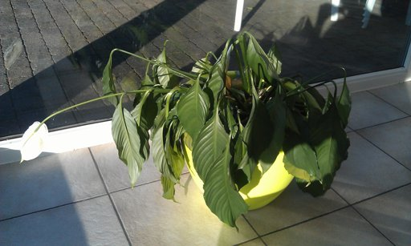

- Original label: wilted
- Source: wilted
- File: `data/raw/wilted/houseplant_images/wilted/wilted_072.jpg`

## 4. watering

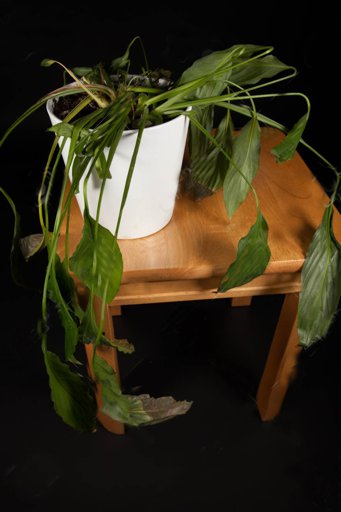

- Original label: wilted
- Source: wilted
- File: `data/raw/wilted/houseplant_images/wilted/wilted_263.jpg`

## 5. fungal_bacterial

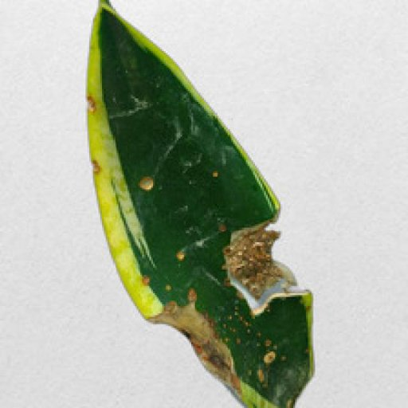

- Original label: Snake Plant Anthracnose
- Source: indoor
- File: `data/raw/indoor/indoor/valid/Snake_Plant_Anthracnose/Snake_Plant_Anthracnose_006_jpg.rf.8282ab2159e4b337ef7b777fb70f02b4.jpg`

## 6. fungal_bacterial

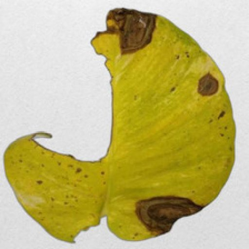

- Original label: Money Plant Bacterial wilt disease
- Source: indoor
- File: `data/raw/indoor/indoor/test/Money_Plant_Bacterial_wilt_disease/Money_Plant_Bacterial_wilt_disease_084_jpg.rf.967170278a9bc6050173abf6f0fd1afb.jpg`

## 7. fungal_bacterial

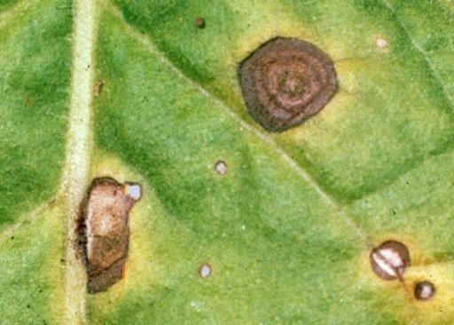

- Original label: cabbage alternaria leaf spot
- Source: plantseg (lesion covers 11% of the image)
- File: `data/raw/plantseg/plantseg/images/test/cabbage_alternaria_leaf_spot_google_0341.jpg`

## 8. fungal_bacterial

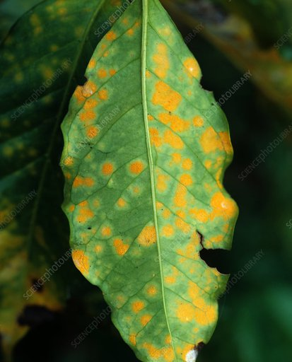

- Original label: coffee leaf rust
- Source: plantseg (lesion covers 46% of the image)
- File: `data/raw/plantseg/plantseg/images/test/coffee_leaf_rust_google_0090.jpg`

## 9. pest

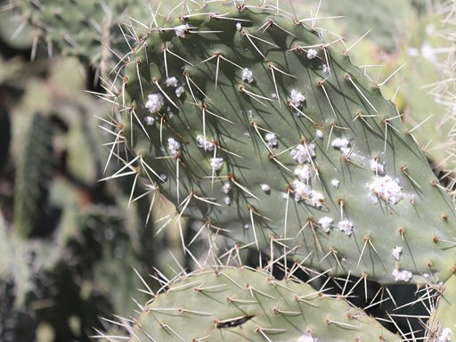

- Original label: Cactus Dactylopius Opuntia
- Source: indoor
- File: `data/raw/indoor/indoor/valid/Cactus_Dactylopius_Opuntia/Dactylopius_opuntia (80).png`

## 10. pest

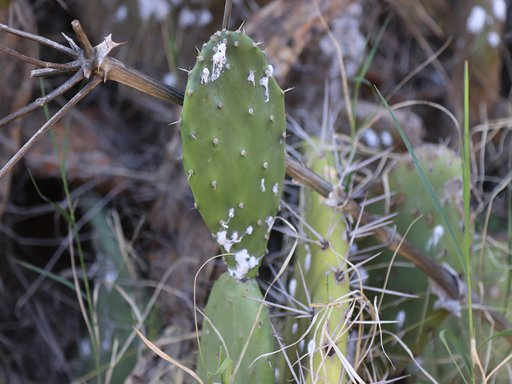

- Original label: Cactus Dactylopius Opuntia
- Source: indoor
- File: `data/raw/indoor/indoor/valid/Cactus_Dactylopius_Opuntia/Dactylopius_opuntia (335).png`

## 11. other

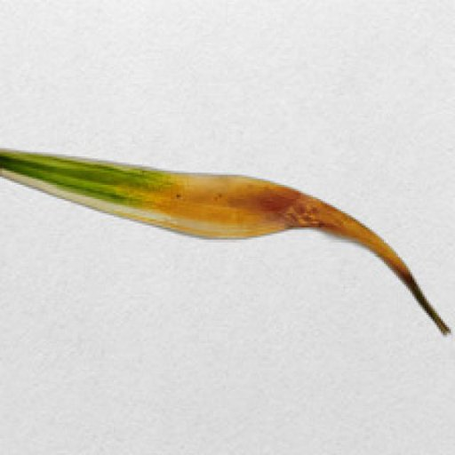

- Original label: Spider Plant Leaf Tip Necrosis
- Source: indoor
- File: `data/raw/indoor/indoor/valid/Spider_Plant_Leaf_Tip_Necrosis/Spider_Plant_Leaf_Tip_Necrosis_071_jpg.rf.95726a29ae8672473b15915427864a7f.jpg`

## 12. other

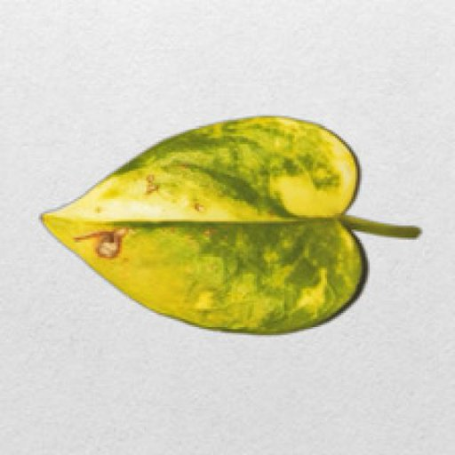

- Original label: Money Plant Manganese Toxicity
- Source: indoor
- File: `data/raw/indoor/indoor/valid/Money_Plant_Manganese_Toxicity/Money_Plant_Manganese_Toxicity_060_jpg.rf.a999240d914b4f809bf37e56f883100b.jpg`
